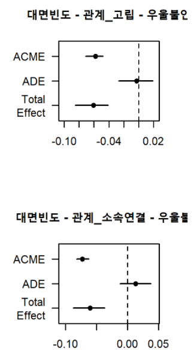
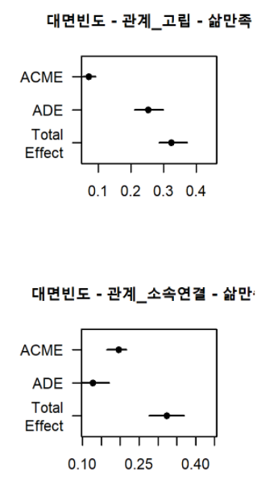
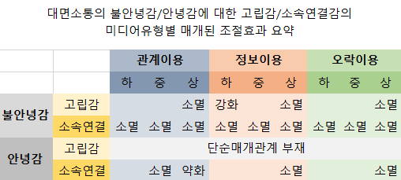

```{r setup, include = FALSE}
library(tidyverse)

options(
  htmltools.dir.version = FALSE, 
  htmltools.preserve.raw = FALSE,
  tibble.width = 60, tibble.print_min = 6,
  crayon.enabled = TRUE
)

knitr::opts_chunk$set(echo = FALSE, message=FALSE, warning=FALSE,
                      comment="", digits = 3, tidy = FALSE, prompt = FALSE, fig.align = 'center',
                      fig.width = 7.252,
                      fig.height = 4,
                      dpi = 300)

# uncomment the following lines if you want to use the NHS-R theme colours by default
# scale_fill_continuous <- partial(scale_fill_nhs, discrete = FALSE)
# scale_fill_discrete <- partial(scale_fill_nhs, discrete = TRUE)
# scale_colour_continuous <- partial(scale_colour_nhs, discrete = FALSE)
# scale_colour_discrete <- partial(scale_colour_nhs, discrete = TRUE)
```


```{r share-again, echo=FALSE}
xaringanExtra::use_share_again()
```


class: title-slide, left, bottom

# `r rmarkdown::metadata$title`
----
## **`r rmarkdown::metadata$subtitle`**
### `r rmarkdown::metadata$author`
### `r rmarkdown::metadata$date`

---
class: inverse, middle
name: data-science-case

# .warmyellow[발표 개요]

----

.pull-left[

.burlywood[연구문제]

**.tomato[I. 대면소통 및 미디어이용이 정신건강에 미치는 차별적 영향: 고립감과 소속연결감의 매개효과]**

1. 미디어이용은 사회관계의 대체재로서 대면소통을 증강하는가 전치하는가? 

2. 고립감 및 소속연결감이 대면소통 및 미디어이용과 불안녕감 및 안녕감 사이의 관계를 차별적으로 매개하는가?

3. 미디어이용은 대면소통, 고립감 및 소속연결감, 불안녕감 및 안녕감 사이의 매개관계를 조절하는가?  


]

.pull-right[   
.left[

**.CornflowerBlue[순 서]** 

1. [논 리]
  1. [대면소통과 미디어](#media1)  
  2. [행동의 이중체계](#2theory1a)  
  3. [기능과 신호](#3theory1a)   

2. [방 법](#method1)  

3. [결 과](#results1)  

4. [논 의](#discussion1)  

]
] <!--end of right-column-->


<!--------------------------  슬라이드 본문 시작 ------------------------------------->

---
name: media1
# 1. 대면소통과 미디어

- 소통(communication): 다양한 맥락에서 채널과 미디어를 통해 정보를 주고받는 일련의 작용을 통해 이뤄지는 의미공유 과정 (나은영, 2015)

  - 관계성은 인간의 가장 근본적인 욕구(Baumeister & Leary, 1995)인데, 이 욕구를 충족하는 수단이 소통. 대면소통을 통해 근본욕구를 충족함으로써, 사회적 기능(관계형성 등)을 정상적으로 수행함으로써 마음의 건강 상태 유지 가능. 

- 미디어: 정보를 표현해 의미를 공유할 수 있도록 하는 수단으로 목소리나 얼굴 등 자연적으로 존재하는 현시미디어(presence media), 문자나 그림 등 문화적으로 생성된 재현미디어(represented media), 종이나 컴퓨터 등 기술적으로 개발한 기계미디어(mechanical media)로 구분 가능.


.footnote[

나은영 (2015). <인간커뮤니케이션과 미디어: 소통공간의 확장>. 한나래

Baumeister, R. F., & Leary, M. R. (1995). The need to belong: Desire for interpersonal attachments as a fundamental human motivation. _Psychological Bulletin, 117_, 497–529. http://dx.doi.org/10.1037/0033-2909.117.3.497.

]


---
name: 1theory1a
# 1a. 미디어이용: 관계/정보/오락이용

- 인류가 종이를 발명한 이후 미디어는 인간사회의 시공간 영역을 크게 확대.
  - 산업혁명을 거치며 종이와 TV는 메시지를 대규모로 공중에 전달 가능  
  - 정보혁명을 통해 컴퓨터로 발신자와 수신자의 상호작용 확대
  - 모바일기술의 발달로 개개인이 핸드폰 휴대해 사용하고, 스마트기기에 핸드폰과 컴퓨터 통합  
  
- 미디어는 소통의 매개수단이므로 미디어의 기능도 소통의 주요 기능과 동일: 관계형성, 정보습득, 및 오락. 

  - 미디어이용은 관계이용, 정보이용, 오락이용으로 구분. 

- 기계미디어(이하 미디어)를 이용한 소통도 소통이므로 대면소통처럼 인류가 사회를 구성해 생존과 번식의 문제를 해결하는데 기여. 


---
name: 1theory1b
# 1b. 증강과 전치

- 그러나, 미디어이용과 대면소통의 관계에 대해서는 상반된 논리가 대립중이고, 두 상반된 논리에 대해 각각 지지하는 근거도 존재하는 모순적 상황 (Valkenburg, 2021)

  - 증강가설(augmentation hypothesis): 미디어이용이 대면소통 시간을 증강해 대면소통을 통한 사회관계 형성 기여하므로 정신건강에 긍정적 영향
  
  - 전치가설(displacement hypothesis): 미디어이용이 대면소통 시간을 전치해 대면소통을 통한 사회관계 형성 방해하므로 정신건강에 부정적 영향 

- 두 가설에 대한 근거가 혼재하는 이유는 미디어이용이 대면소통을 증강하기도 하고 전치하기도 하는 이중적 역할을 하기 때문. 

  1. 미디어의 채널용량 한계로, 대면소통과 달리, 사회관계의 긍정적 측면만을 증강하기 때문일 가능성이 있다. 
    - 행동의 이중 체계: 접근과 회피 (다음 장에서 상술)
    - 채널(Channel): 의미공유를 가능하도록 하는 물리적 수단. 전달할 수 있는 신호에 상한 용량이 있어, 의미공유 제약 요인으로 작용. 
    
  2. 기능과 신호를 혼동해 매개변수(관계성)와 산출변수(정신건강)를 구분하지 않았기 때문일 가능성이 있다 (다음 장에서 상술).    


.footnote[

Valkenburg, P. M. (2021). Social media use and well-being: what we know and what we need to know. _Current Opinion in Psychology, 45_. 101294 https://doi.org/10.1016/j.copsyc.2021.12.006

]


---
name: 2theory1a
# 2a. 행동의 이중 체계(dual system)

- 모든 생물의 생존과 번식을 위한 행동은 크게 보상에 대한 접근(approach)과 처벌에 대한 회피(avoidance) 등 두가지 독립된 체계로 분리 (Gray, 1990). 

  - 흔히 이 접근과 회피 체계는 마치 단일 선상의 서로 반대되는 것으로 간주돼 접근의 반대는 회피, 부정감정의 반대는 긍정감정 혹은 그 반대인 것으로 여기는 경우가 있지만, 실은 접근과 회피 그리고 긍정과 부정 등의 체계는 신경수준에서 상호 독립적. 
  
  - 두 체계의 독립성은 신경 및 심리수준의 다양한 이론을 통해 확인(e.g., Caccioppo et al., 1999)
  

.footnote[

Gray, J. A. (1990). Brain systems that mediate both emotion and cognition. _Cognition & Emotion, 4_(3), 269-288. https://doi.org/10.1080/02699939008410799

Cacioppo, J. T., Gardner, W. L., & Berntson, G. G. (1999). The affect system has parallel and integrative processing components form follows function. _Journal of Personality and Social Psychology, 76_(5), 839–855. http://dx.doi.org/10.1037/
0022-3514.76.5.839.

]


---
name: 2theory1b
# 2b. 정신건강: 불안녕감 vs. 안녕감

- 정신건강(mental health): 문제를 해결할 수 있는 기능(업무수행, 호혜적 관계형성, 내면 세계 충만 등)이 유지된 상태(Gross & Munoz, 1995). 

- 정신건강도 인간행동의 이중체계의 일부로서 불안녕감(ill-being)과 안녕감(well-being)으로 구분. 

  - 불안녕감: 기능의 이상작동에 대한 전반적인 평가. 우울불안과 같은 감정적 고통. 감정적 고통은 물리적 고통과 마찬가지로 문제발생(예: 사회적 고립)에 대해 주의를 기울여 문제를 해결하도록 하는 신호 (Watson & Andrews, 2002). 
  
  - 안녕감: 기능의 정상적인 작동에 대한 전반적인 평가. 삶의 만족과 같은 감정적 쾌락. 적합도를 향상시키는 성취(예: 호혜적 관계형성)에 대해 보상을 통해 문제해결 지속하도록 하는 신호 (Buss, 1999; Diener, 2006). 
  

.footnote[

Gross, J. J., & Muñoz, R. F. (1995). Emotion regulation and mental health. _Clinical Psychology: Science and Practice, 2_(2), 151-164. https://psycnet.apa.org/doi/10.1111/j.1468-2850.1995.tb00036.x

Buss, D. M. (2000). The evolution of happiness. _American Psychologist, 55_(1), 15. https://doi.org/10.1037/0003-066X.55.1.15

Diener, E. (2006). Guidelines for national indicators of subjective well-being and ill-being. _Journal of Happiness Studies, 7_(4), 397-404.https://doi.org/10.1007/s10902-006-9000-y

Watson, P. J., & Andrews, P. W. (2002). Toward a revised evolutionary adaptationist analysis of depression: The social navigation hypothesis. _Journal of Affective Disorders, 72_(1), 1-14. https://doi.org/10.1016/S0165-0327(01)00459-1

]  


---
name: 3theory1a
# 3a. 기능 vs. 신호

- 기능(functioning)과 기능작동에 대한 신호 구분 필요. 

- 기능과 신호 중 무엇이 정신건강의 본질인지를 두고 논쟁이 있으나(예: Ryan & Deci, 2001), 이 연구에서는 기능을 신호를 예측하는 변수로 판단. 기능은 문제를 해결 또는 근본욕구를 충족하는 도구 혹은 자원이고, 신호는 기능이 제대로 작동하는지를 행위자가 파악할 수 있도록 함으로써 적합도 향상.  


.footnote[


Ryan, R. M., & Deci, E. L. (2001). On happiness and human potentials: A review of research on hedonic and eudaimonic well-being. _Annual Review of Psychology,52_, 141–166. http://dx.doi.org/10.1146/annurev.psych.52.1.141

]


---
name: 3theory1b
# 3b. 안녕감 논쟁

- 유데모닉(Eudaimonic) 안녕감 혹은 심리적 안녕감(Psychological well-being)을 지지하는 학자들은 안녕감이 다차원적 개념으로서 삶만족 단일 척도로는 온전하게 측정할 수 없다고 주장. 
  
  - 이들은 안녕감이란 쾌락의 경험이나 삶의만족 그 이상의 개념으로서 다양한 삶의 문제해결능력을 포괄하는 심리적 기능 혹은 유데모니아(Eudaimonia)이어야 한다고 지적 (예: Ruggeri et al., 2020). 
  
  - 심리적 안녕감과 주관적 안녕감에서 안녕감이란 용어를 동일하게 사용한다고 해서 기능에 대한 개념과 신호에 대한 개념을 동일한 수준의 개념으로 혼동. 
  
- 주관적 안녕감은, 쾌락이 공동통화로서 가치에 대한 범용적인 신호 역할을 하는 것처럼 (Cabanac, 1992), 삶에 대한 전반적인 평가 (Diener, 2006). 앞서 지적한대로 심리적안녕감은 기능으로서 기능의 정상작동 여부에 대한 신호인 주관적 안녕감을 예측하는 변수. 


.footnote[

Cabanac, M. (1992). Pleasure: the common currency. _Journal of Theoretical Biology, 155_(2), 173-200. https://doi.org/10.1016/S0022-5193(05)80594-6

Ruggeri, K., Garcia-Garzon, E., Maguire, Á., Matz, S., & Huppert, F. A. (2020). Well-being is more than happiness and life satisfaction: a multidimensional analysis of 21 countries. _Health and Quality of Life Outcomes, 18_(1), 1-16. https://doi.org/10.1186/s12955-020-01423-y

]


---
name: 4theory1a
# 4a. 관계성

- 기능의 요소에 대해서는 다양한 이론이 경합중. 심리적 안녕감(psychological well-being) 문헌에서는 자율성(autonomy), 환경통제(environmental mastery), 개인성장(personal growth), 긍정관계(positive relatedness to others), 삶의 목적(a sense of purpose in life), 자아수용(self-acceptance)을 들지만, 자기결정성(self-determination) 문헌에서는 자율성, 유능성, 관계성에만 국한. 소속감만을 가장 근본적인 기능으로 제시하는 문헌도 존재 (Pittman & Zeigler, 2007).

- 이 연구에서는 관계성이 생존과 번식이 가장 근본 기능이라는 관점(Baumeister & Leary, 1995)을 채택해 관계성에 초점. 

  - 인류는 사회구성을 자연환경에 대한 적응전략으로서 채택. 사회구성은 상당히 성공적이어 인류가 지구에서 번성하게 되는 기반이나, 동시에 인류에게 사회는 적응해야 하는 또 다른 환경으로 작용. 

  - 관계성(relatedness)은 인간의 근본 욕구 증 하나로서 사회집단에 소속돼 다른 사회적 존재와의 연결 및 고립회피의 기능 (Baumeister & Leary, 1995; Deci & Ryan, 2000). 

 

.footnote[

Deci, E. L., & Ryan, R. M. (2000). The ‘‘what’’ and ‘‘why’’ of goal pursuits: Human needs and the self-determination of behavior. _Psychological Inquiry, 11_, 227–268. http://dx.doi.org/10.1207/S15327965PLI1104_01.

Pittman, T. S., & Zeigler, K. R. (2007). Basic human needs. In  A. W. Krugalnski & E. T. Higgins (Eds.). Social psychology: Handbook of basic principles (pp. 473-489). Guildord. 


]


---
name: 4theory1b
# 4b. 관계성: 고립 대 소속연결

- 관계성은 인간행동의 이중체계의 일부로서 사회적 고립의 회피와 다른 사회적 존재와의 연결추구 등 크게 2개 요소로 구성. 
  
  - 사회적 고립(Social isolation): 사회집단에서 무시되거나 배제되는 것 (Williams, 2007)
  
  - 연결(Connectedness): 다른 사회적 존재와 호혜적으로 형성된 관계. 관계적 연결(relational connectedness)과 집합적 연결(collective connectedness)로 구성 (Hawkley et al., 2005). 관계적 연결과 집합적 연결은, 혼용해서는 안되나, 상호긴밀하게 얽여 있어 독립적이지 않고 상호보완적 (Brewer, 2007). 


.footnote[

Brewer, M. B. (2007). Social identity and close relationships: What is the connection? Presented at Sydney symposiums of social psychology 2007. http://
www.sydneysymposium.unsw.edu.au/2007/Chapters/BrewerSSSP07.pdf.

Hawkley, L. C., Browne, M. W., & Cacioppo, J. T. (2005). How can I connect with thee? Let me count the ways. _Psychological Science, 16_, 798–804. http://dx.doi.org/10.1111/j.1467-9280.2005.01617.x.

Williams, K. (2007). Ostracism. _Annual Review of Psychology, 58_, 425–452. http://dx.doi.org/10.1146/annurev.psych.58.110405.085641.

]


---
name: hypo0
# 연구 개요

- 기존 연구에서 미디어이용의 긍정효과와 부정효과가 혼재하는 이유는 접근과 회피 혹은 긍정과 부정체계를 구분하지 않고, 기능과 신호를 구분지 않았기 때문일 가능성이 있다. 

- 이를 확인하기 위해 이 연구에서는 사회관계성을 고립회피와 소속 및 연결추구로 구분하고, 정신건강은 불안녕감과 안녕감으로 구분해, 미디어이용과 대면소통의 관계성 및 정신건강의 두 측면과의 차별적 관련성 탐색. 

- 이를 위해, 증강가설 대 전치가설의 틀에서 다음과 같은 연구문제를 탐색하고 한다. 

1. 미디어이용은 사회관계의 대체재로서 대면소통을 증강하는가 전치하는가? 

2. 고립감 및 소속연결감이 대면소통 및 미디어이용과 불안녕감 및 안녕감 사이의 관계를 차별적으로 매개하는가?

3. 미디어이용은 대면소통, 고립감 및 소속연결감, 불안녕감 및 안녕감 사이의 매개관계를 조절하는가?  


---
name: hypo1
# 가설 & 연구질문1

**.tomato[I. 미디어이용은 사회관계의 대체재로서 대면소통을 증강하는가 전치하는가?]  **

- **증강가설(augmentation hypothesis):**  

  H1a: 미디어이용이 대면소통을 증강하므로 미디어이용 시간이 많을수록 대면소통시간은 증가할 것이다. 
  
- **전치가설(displacement hypothesis):**  

  H1b- 미디어이용이 대면소통을 전치하므로 미디어이용 시간이 많을수록 대면소통시간은 감소할 것이다. 
  
  
RQ1a: 미디어의 유형별(핸드폰, 스마트기기, 컴퓨터, TV, 종이)이용 시간은 대면소통시간의 관련성은 차별적으로 나타나는가? 

RQ1b: 미디어 이용양식(관계이용, 정보이용, 오락이용)에 따른 이용시간은 대면소통시간의 관련성은 차별적으로 나타나는가? 

  
.footnote[
 
]


---
name: hypo2
# 가설 & 연구질문2

**.tomato[II. 고립감 및 소속연결감이 대면소통 및 미디어이용과 불안녕감 및 안녕감 사이의 관계를 차별적으로 매개하는가?]**  

- **증강가설(augmenttaion hypothesis):**  

  H2a: 미디어이용이 대면소통을 증강하므로 미디어이용은 대면소통과 마찬가지로 고립감 및 소속연결감이 불안녕감과 안념감에 대한 긍정적 영향을 차별적으로 매개할 것이다. 즉, 고립감은 불안녕감을 매개하고, 소속연결감은 안녕감을 매개할 것이다. 


- **전치가설(displacement hypothesis):**  

  H2b: 미디어이용이 대면소통을 전치하므로 미디어이용은 대면소통과 달리  증가는 고립감 및 소속연결감이 불안녕감과 안녕감에한 부정적 영향을 차별적으로 매개할 것이다. 즉, 고립감은 불안녕감을 매개하고, 소속연결감은 안녕감을 매개할 것이다. 


RQ2: 미디어 이용양식(관계이용, 정보이용, 오락이용)에 따른 이용시간은 고립감과 소속연결감을 통해 불안녕감과 안녕감에 차별적으로 영향을 미치는가? 즉, 관계이용, 정보이용, 오락이용 등의 이용시간 증가는 고립감을 통해 불안녕감 증가로 이어지는가, 아니면 소속연결감을 통해 안녕감의 증가로 이어지는가? 


---
name: hypo3
# 가설 & 연구질문3

**.tomato[III. 미디어이용은 대면소통, 고립감 및 소속연결감, 불안녕감 및 안녕감 사이의 매개관계를 조절하는가?]**  


- **증강가설(augmenttaion hypothesis):**  

  H3a: 미디어이용이 대면소통을 증강하므로 미디어이용시간이 많을수록 대면소통, 고립감 및 소속연결감, 불안녕감 및 안녕감 사이의 매개관계를 긍정적으로 조절할 것이다. 즉, 미디어이용 시간이 많은 집단이 적은 집단에 비해 대면소통, 고립감 및 소속연결감, 불안녕감 및 안녕감 사이의 매개관계를 강화할 것이다. 


- **전치가설(displacement hypothesis):**  

  H3b: 미디어이용이 대면소통을 전치하므로 미디어이용시간이 많을수록 대면소통, 고립감 및 소속연결감, 불안녕감 및 안녕감 사이의 매개관계를 부정적으로 조절할 것이다. 즉, 미디어이용 시간이 많은 집단이 적은 집단에 비해 대면소통, 고립감 및 소속연결감, 불안녕감 및 안녕감 사이의 매개관계를 약화할 것이다.


RQ3: 미디어 이용양식(관계이용, 정보이용, 오락이용)에 따른 이용시간 증가는  고립감 및 소속연결감, 불안녕감 및 안녕감 사이의 관계를 차별적으로 조절하는가? 즉, 미디어이용시간이 많은 집단과 적은 집단 사이에 관측되는 대면소통, 고립감 및 소속연결감, 불안녕감 및 안녕감 사이의 매개관계 강화 혹은 약화 효과가 관계이용, 정보이용, 오락이용 등의 이용 유형에 따라 달리 나타나는가? 


```{r message=TRUE, warning=TRUE, include=FALSE}
if(!require(remote)) install.packages("remote")
if(!require(gtExtras)) remotes::install_github("jthomasmock/gtExtras")
if(!require(processR)) remotes::install_github("cardiomoon/processR")
if(!require(xaringanExtra)) remotes::install_github("gadenbuie/xaringanExtra")

c("summarytools", "psych", "lm.beta", "lavaan", "mediation", "processR",
  "writexl", "readxl", "gt", "kableExtra", "gtExtras",  
  "janitor", "here", "corrr", "Hmisc", "correlation",
  "see", "ggraph",
  "tidyverse", "tidytext", "lubridate") -> pkg_v
pkg_v %in% installed.packages()[,"Package"] -> pkg_installed
( pkg_v[!pkg_installed] -> pkg_new )

if(length(pkg_new)) install.packages(pkg_new)

lapply(pkg_v, require, ch = T)

readRDS("data/v5889.rds") -> v5889_df; v5889_df -> df
df %>% group_by(성) %>% summarise(N = n(), P = N/nrow(df)*100) -> sex_df
df %>% group_by(학력) %>% summarise(N = n(), P = N/nrow(df)*100) -> edu_df

df %>% summarise(M = mean(나이), SD = sd(나이)) -> age_df
df %>% summarise(M = mean(소득), SD = sd(소득)) -> income_df


options(digits = 1)
```

---
name: hypo0
# 연구 모형

- X: 대면소통  
- Mi: 고립감 또는 소속연결감  
- Y: 불안녕감 또는 안녕감  
- W: 미디어이용(관계이용, 정보이용, 오락이용)  

```{r}
pmacroModel(8)

```


---
name: method1
# 참가자


- 설문전문업체에 등록된 패널에 설문참가 안내 이메일을 보내 자료를 수집했다. 업체의 설문풀에 등록된 사람 중 8,196명이 설문안내 이메일을 통해 접속했다. 이중 5,967명이 응답을 완료했다. 불성실 응답자를 제외한 5889명(남성 = `r sex_df$N[1]`; 나이 *M* = `r age_df$M`, *SD* = `r age_df$SD`)을 최종 분석 대상에 포함했다.

- 응답자의 교육수준은 `r edu_df$N[11]+edu_df$N[12]`명(`r edu_df$P[11]+edu_df$P[12]`%)이 석사 또는 박사학위 취득, `r edu_df$N[8]+edu_df$N[9]+edu_df$N[10]`명(`r edu_df$P[8]+edu_df$P[9]+edu_df$P[10]`%)이 대학 재학/중퇴/졸업, `r edu_df$N[5]+edu_df$N[6]+edu_df$N[7]`명(`r edu_df$P[5]+edu_df$P[6]+edu_df$P[7]`%)이 전문대학 재학/중퇴/졸업, `r edu_df$N[4]`명(`r edu_df$P[4]`%)이 고등학교 졸업, `r edu_df$N[1]+edu_df$N[2]+edu_df$N[3]`명(`r edu_df$P[1]+edu_df$P[2]+edu_df$P[3]`%)이 무학/초등학교졸업/중학교졸업이다. 

- 연간 가구소득은 월평균으로 100만원씩 증가하는 12점 척도(1 = 100만원 미만,  12 = 1,100만원 이상)로 측정했다(*M* = `r income_df$M`, *SD* = `r income_df$SD`). 

- ㅇㅇㅇ사업의 일부로서 여러 연구 프로젝트와 공동 설문조사를 실시했다. 설문참여자들은 설문사이트에 접속해 설문에 대한 간단한 소개, 개인정보 보호 및 위험과 권리 등에 대해 안내를 받은 후, 인구통계 정보를 기입한 다음, 다른 연구프로젝트에 대한 설문문항과 함께 이 연구의 설문문항에 대해 응답했다. 총 170문항이 인구통계, 대면소통, 개인차(정신건강 등), 미디어이용, 코로나19관련 문항  순서로 제시됐다. 응답시간은 평균 00분이다. 대부분의 응답자들이 00분을 넘기지 않고 응답을 마쳤다. 


- 자료수집에 대해서는 기관생명윤리위원회의 심의를 받았다. 

---
name: method2iv1
# 측정1a: 대면소통

4개 유형(같이 살고 있는 사람, 비동가 가족 혹은 친척, 업무/학업 목적의 지인/친구/동료, 사적인 목적의 지인/친구/동료)의 사람들과의 접촉 빈도("지난 한 달 평균 귀하는 다음의 사람들과 얼마나 자주 직접 만나서 대화를 하셨습니까?")를 통해 측정했다(1 = 전혀 안했다, 9 = 한 시간에 여러번). 


---
name: method2iv2
# 측정1b: 미디어이용

미디어이용에 대해 Rosen et al. (2013)과 권호열 등(2020)을 참조하여 유형 별로 5종(핸드폰 (스마트폰 제외), 스마트 기기(스마트폰, 스마트TV, 태블릿 등), 컴퓨터(노트북 혹은 데스크탑PC), TV, 및 종이(책 또는 신문))으로 구분해 질문 문항을 제시했다. 미디어 이용 시간은 한달 기준으로 9점척도(1 = 전혀 교류(or 이용)하지 않았다, 9 = 한 시간에 여러 번)로 측정했다. 

  
.footnote[
 
Rosen, L. D., Whaling, K., Carrier, L. M., Cheever, N. A., & Rokkum, J. (2013). The media and technology usage and attitudes scale: An empirical investigation. _Computers in Human Behavior, 29_(6), 2501-2511.

권호열 등 (2020). <2020한국미디어패널조사>. 정보통신정책연구원 https://stat.kisdi.re.kr/kor/contents/ContentsList.html

]

---
name: method2iv3
# 측정1c: 미디어이용양식

미디어이용양식은 관계이용, 정보이용, 오락이용 등 3개 양식으로 구분해 Rosen et al. (2013)과 권호열 등(2020)을 참조하고 한국인의 최근 미디어 이용 양식을 반영해 각 유형별 5~6 종의 미디어 이용 시간을 한달 기준으로 9점척도(1 = 전혀 교류(or 이용)하지 않았다, 9 = 한 시간에 여러 번)로 측정했다. 

  - 관계이용("귀하는 지난 한 달간 각 매체를 통해 다른 사람들과 얼마나 자주 교류하셨습니까?")은 음성통화, 문자메신저(휴대폰문자, 카카오톡, 네이트온, 라인 등), 화상통화(페이스타임, 카카오톡 영상통화), SNS(페이스북, 인스타그램, 트위터, 카카오스토리 등), 이메일, 온라인 커뮤니티 및 게시판 등 6종의 미디어 이용에 대해 각각 질문해 평균을 계산했다. 
  
  - 정보이용("귀하는 지난 한 달 간 아래 각 매체를 통해 얼마나 자주 뉴스/정보를 이용하셨습니까?")은  TV뉴스, 라디오, 종이신문, 인터넷 포털/언론사 홈페이지, SNS(페이스북, 인스타그램, 트위터, 카카오스토리 등), 동영상 스트리밍 사이트(유튜브, 트위치, 아프리카TV 등) 등 6종의 미디어 이용에 각각 질문해 평균을 계산했다. 
  
  - 오락이용("귀하는 지난 한 달간 무료함을 달래거나 오락을 위해 아래 각 컨텐츠를 얼마나 자주 이용하셨습니까?")은 영화/드라마, 웹툰, 컴퓨터/온라인게임, 스포츠중계, 음악/뮤직비디오 등 5종의 미디어 이용에 각각 질문해 평균을 계산했다.  

.footnote[
 
Rosen, L. D., Whaling, K., Carrier, L. M., Cheever, N. A., & Rokkum, J. (2013). The media and technology usage and attitudes scale: An empirical investigation. _Computers in Human Behavior, 29_(6), 2501-2511.

권호열 등 (2020). <2020한국미디어패널조사>. 정보통신정책연구원 https://stat.kisdi.re.kr/kor/contents/ContentsList.html

]

---
name: method3
# 측정2: 정신건강  

정신건강은 불안녕감과 안녕감 두 측면으로 구분해 측정했다. 

- 불안녕감

  정신건강진단도구로 널리 사용되는 Goldberg & Hiller(1979)의 일반건강설문지(General Health Questionnaire) 12문항 축약형을 박종익 등(2012)이 한국어로 개발한 한국판 일반건강 설문지에서 문항 4개 추출해 7점 척도((1 = 전혀 그렇지 않다, 7 = 매우 그렇다)로 측정했다. 대규모 설문수집이라 12문항을 모두 이용하지 않고 우울불안과 같은 불안녕감에 대한 문항으로서 요인적재치가 높은 4문항("근심 때문에 잠을 잘 자지 못한다,"  "닥친 문제를 극복할 수 없다고 느낀다,"  "불행하거나 우울하다고 느낀다,"  "항상 긴장하고 있다고 느낀다")을 선별했다 (&alpha; = 0.86) . 

- 안녕감

  삶의 만족에 대해 단일 문항("나는 내 삶에 만족한다")을 이용해 7점 척도로 측정했다 (1 = 전혀 그렇지 않다, 7 = 매우 그렇다). 단일 문항의 측정 신뢰성이 확인돼 있다 (Lucas & Brent, 2012).
  

.footnote[

박종익, 김영주, & 조맹제. (2012). 한국판 일반 건강 설문지의 요인 구조. <신경정신의학>, 51, 178-184.  
Goldberg, D.P., Hillier, V.F. (1979) A scaled version of the General Health Questionnaire. _Psychological Medicine 9_, 139-145.  
Lucas, R. E., & Brent Donnellan, M. (2012). Estimating the reliability of single-item life satisfaction measures: Results from four national panel studies. _Social Indicators Research, 105_(3), 323-331. https://doi.org/10.1007/s11205-011-9783-z  

]


---
name: method4
# 측정3: 고립감과 소속연결감

사회관계는 개정판 UCLA 외로움 척도(Russell et al., 1980)에서 3요인(고립, 소속, 연결)을 구분한 (Hawkley et al., 2005)를 토대로 고립감과 소속연결감에 해당하는 문항을 이용해 측정했다. 대규모 설문수집이라 20문항을 모두 이용하지 않고, 고립, 소속, 연결 등 각 요인의 적재치를 기준으로 고립감 2개 문항("나는 사람들과 교류가 부족하다," "나는 다른 사람들로부터 소외감을 느낀다")을 선별했고(*r* = .63), 소속연결 4개 문항("나는 내 주위 사람들과 마음이 통한다,"
"나는 내 주위 사람들과 많은 공통점을 가지고 있다," "나와 함께 얘기를 나눌 수 있는 사람들이 있다," "나는 의지할 사람들이 있다")을 선별했다(&alpha; = .89). Kim (1997)의 한국어판 문항을 커뮤니케이션학 연구자 7인이 공동으로 각 문항의 한국어 표현을 가다듬었다. 7점 척도((1 = 전혀 그렇지 않다, 7 = 매우 그렇다)로 측정했다.


.footnote[

Hawkley, L. C., Browne, M. W., & Cacioppo, J. T. (2005). How can I connect with thee? Let me count the ways. _Psychological Science, 16_(10), 798-804.

Kim, O. S. (1997). Korean version of the revised UCLA Loneliness Scale: Reliability
and validity test. _Journal of Korean Academy of Nursing, 27_, 871–879.

Russell, D., Peplau, L. A., & Cutrona, C. E. (1980). The revised UCLA Loneliness Scale: concurrent and discriminant validity evidence. _Journal of Personality and Social Psychology, 39_(3), 472.

]


```{r}
apa_style <- function(data) {
  data %>%
    opt_table_lines(extent = "none") %>%
    tab_options(
      heading.border.bottom.width = 2,
      heading.border.bottom.color = "black",
      heading.border.bottom.style = "solid",
      table.border.top.color = "white",
      table_body.hlines.color = "white",
      table_body.border.top.color = "black",
      table_body.border.top.style = "solid",
      table_body.border.top.width = 1,
      heading.title.font.size = 12,
      table.font.size = 12,
      heading.subtitle.font.size = 12,
      table_body.border.bottom.color = "black",
      table_body.border.bottom.width = 1,
      table_body.border.bottom.style = "solid",
      column_labels.border.bottom.color = "black",
      column_labels.border.bottom.style = "solid",
      column_labels.border.bottom.width = 1
    ) %>%
      opt_table_font(font = "times")
}
```

---
name: tool1
# 분석도구1

모든 분석은 윈도10x64(build 19044)의 R 4.1.2 환경에서 이뤄졌다 (R Core Team, 2021). 데이터전처리는 R의 기본함수 및 tidyverse패키지 (Wickham et al., 2019) 함수를 이용했다. 데이터분석 및 시각화는 R의 기본함수 및 lm.beta (Behrendt, 2014), correlation (Makowski et al., 2019), Hmisc(Harrell, 2021), see (Ludecke et al., 2021)), ggraph (Pedersen, 2021), mediation (Tingley et al., 2014), processR (Moon, 2021) gt (Iannone, et al., 2021) 등의 패키지가 제공하는 함수를 이용했다.  

---
name: tool2
# 분석도구2

.footnote[

Behrendt, S. (2014). lm.beta: Add Standardized   Regression Coefficients to lm-Objects. R package version   1.5-1. https://CRAN.R-project.org/package=lm.beta 

Harrell, F. E. (2021). Hmisc: Harrell Miscellaneous. R package version 4.6-0.  https://CRAN.R-project.org/package=Hmisc

Iannone, R., Cheng, J. & Schloerke. B. (2021). gt: Easily Create Presentation-Ready Display Tables. R   package version 0.3.1.   https://CRAN.R-project.org/package=gt 

Ludecke et al., (2021). see: An R Package for   Visualizing Statistical Models. _Journal of Open Source Software, 6_(64), 3393.   https://doi.org/10.21105/joss.03393  

Makowski, D., Ben-Shachar, M. S., Patil, I., & Ludecke,   D. (2019). Methods and Algorithms for Correlation   Analysis in R. _Journal of Open Source Software, 5_(51),   2306. doi:10.21105/joss.02306   

Moon, K-W (2021). processR: Implementation of the  'PROCESS' Macro. R package version 0.2.6.  https://CRAN.R-project.org/package=processR

Pedersen, T. L. (2021). ggraph: An Implementation of   Grammar of Graphics for Graphs and Networks. R package   version 2.0.5. https://CRAN.R-project.org/package=ggraph  

R Core Team (2021). R: A language and environment for statistical computing. R Foundation for Statistical Computing, Vienna, Austria. https://www.R-project.org/.

Tingley, D., Yamamoto, T., Hirose, K., Keele, L., & Imai, K. (2014). mediation: R Package for   Causal Mediation Analysis. _Journal of Statistical   Software, 59_(5), 1-38. URL   http://www.jstatsoft.org/v59/i05/.  

Wickham et al., (2019). Welcome to the tidyverse.  _Journal of Open Source Software, 4_(43), 1686,  https://doi.org/10.21105/joss.01686  

]


---
name: results
# 결과: 기술통계

- 대면소통시간은 고립감($r = -.12$), 소속연결감(r = .24), 불안녕감(r = -.08), 안녕감(r = .21)에 대해 모두 유의하게(p < .001) 긍정적인 방향으로 상관성이 나타났다. 

- 미디어이용시간은 소속연결감(r = .17)과 안녕감(r = .16)에 대해 유의하게(p < .001) 긍정적인 방향으로 상관성이 나타났다. 고립감에 대해서도 낮은 수준의 상관성 (r = -.04)이 유의하게 (p < .01) 나타났지만 불안녕감에 대해서는 상관성(r = .003)이 유의하지 않았다 (p = .8).

```{r eval=FALSE, message=FALSE, warning=FALSE, include=FALSE}
df %>% corrr::correlate() 
df %>% as.matrix() %>% rcorr()
```


```{r echo=FALSE, message=FALSE, warning=FALSE}
apply_if <- function(mat, p, f) {
  # Fill NA with FALSE
  p[is.na(p)] <- FALSE
  mat[p] <- f(mat[p])
  mat
}
apaCorr <- function(mat, corrtype = "spearman") {
  matCorr <- mat
  if (class(matCorr) != "rcorr") {
    matCorr <- rcorr(mat, type = corrtype)
  }

  # Add one star for each p < 0.05, 0.01, 0.001
  stars <- apply_if(round(matCorr$r, 2), matCorr$P < 0.05, function(x) paste0(x, "*"))
  stars <- apply_if(stars, matCorr$P < 0.01, function(x) paste0(x, "*"))
  stars <- apply_if(stars, matCorr$P < 0.001, function(x) paste0(x, "*"))
  # Put - on diagonal and blank on upper diagonal
  stars[upper.tri(stars, diag = T)] <- "-"
  stars[upper.tri(stars, diag = F)] <- ""
  n <- length(stars[1,])
  colnames(stars) <- 1:n
  # Remove _ and convert to title case
  row.names(stars) <- tools::toTitleCase(sapply(row.names(stars), gsub, pattern="_", replacement = " "))
  # Add index number to row names
  row.names(stars) <- paste(paste0(1:n,"."), row.names(stars))
  stars
}

options(digits = 3)
v5889_df %>% dplyr::select(대면빈도, 미디어시간, 관계이용, 정보이용, 오락이용, 관계_고립, 관계_소속연결, 우울불안, 삶만족) -> df

df %>% map_dfc(mean) %>% fashion(decimals = 2) %>% as_tibble() %>% 
  pivot_longer(everything(), names_to = "Mname", values_to = "M") -> mean_df
df %>% map_dfc(sd) %>% fashion(decimals = 2) %>% as_tibble() %>% 
  pivot_longer(everything(), names_to = "SDname", values_to = "SD") -> sd_df
df %>% corrr::correlate() %>% shave(upper = T) %>% 
  fashion(decimals = 2, na_print = "-") %>% as_tibble() -> cor_df
df %>% as.matrix() %>% apaCorr(corrtype = "pearson") %>% 
  as.data.frame() -> cor_df
tibble(Variable = c(
  "1. F2F Frequency ",
  "2. Media Use",
  "3. Media Use: Relation",
  "4. Media Use: Information",
  "5. Media Use: Entertainment",
  "6. Isolation",
  "7. Connectedness",
  "8. Ill-being",
  "9. Well-being"
)) -> row_df

bind_cols(row_df, mean_df[2], sd_df[2], cor_df) %>% 
  gt() %>% gt_theme_guardian() %>% 
  tab_header(md("**Table 1.** Descriptive Statistics and Correlations(Pearson) for Study Variables(*N* = 5889)")
  ) %>% cols_label(
    M = md("*M*"), SD = md("*SD*")
  ) %>% cols_width(
    Variable ~ px(220)
  ) %>% tab_source_note(
    source_note = md("_Note._ * _p_ < .05,  ** _p_ < .01,  *** _p_ < .001; F2F = Face-to-Face")
  ) 

```


---
name: results1a
# 결과: 가설1: 미디어이용과 대면소통
.left-column2[

미디어이용이 대면소통을 증강하는지 혹은 전치하는지 검정하기 위해 편상관분석을 이용해 미디어이용시간과 대면소통시간의 관계를 분석했다.  

가우시안 그래프 모형으로 편상관관계 분석결과를 시각화했다. 모든 유형의 미디어이용 시간은 대면소통 시간과 정의 상관성이 나타난다. 자세한 내용은 다음 페이지에.  
]

.right-column8[


```{r}
apply_if <- function(mat, p, f) {
  # Fill NA with FALSE
  p[is.na(p)] <- FALSE
  mat[p] <- f(mat[p])
  mat
}

apaCorr <- function(mat, corrtype = "pearson") {
  matCorr <- mat
  if (class(matCorr) != "rcorr") {
    matCorr <- rcorr(mat, type = corrtype)
  }

  # Add one star for each p < 0.05, 0.01, 0.001
  stars <- apply_if(round(matCorr$r, 2), matCorr$P < 0.05, function(x) paste0(x, "*"))
  stars <- apply_if(stars, matCorr$P < 0.01, function(x) paste0(x, "*"))
  stars <- apply_if(stars, matCorr$P < 0.001, function(x) paste0(x, "*"))
  # Put - on diagonal and blank on upper diagonal
  stars[upper.tri(stars, diag = T)] <- "-"
  stars[upper.tri(stars, diag = F)] <- ""
  n <- length(stars[1,])
  colnames(stars) <- 1:n
  # Remove _ and convert to title case
  row.names(stars) <- tools::toTitleCase(sapply(row.names(stars), gsub, pattern="_", replacement = " "))
  # Add index number to row names
  row.names(stars) <- paste(paste0(1:n,"."), row.names(stars))
  stars
}

options(digits = 3)
v5889_df %>% dplyr::select(
  대면빈도, 
  미디어시간, 관계이용, 정보이용, 오락이용, 
  성, 나이, 학력, 소득) -> df

# 편상관분석 represented as Gaussian graphical models
df %>% correlation(partial = T) -> pcor_df
pcor_df %>% plot() 

```
Gaussian Graphical Models of Partial Correlations
]

---
name: results1b
# 결과: 가설1: 미디어이용과 대면소통

.left-column2[

관계이용 시간이 대면소통 시간과 가장 높은 상관성(r = .18, p < .001)이 나타났고, 정보이용의 상관성이 가장 낮았다 (r = .04, p = .01).

]


.right-column8[

```{r}
# pcor_df %>% names()

# 편상관분석. 대면빈도만 표 구성.
pcor_df %>% 
  filter(Parameter1 == "대면빈도") %>% 
  dplyr::select(Variable1 = Parameter1,
                Variable2 = Parameter2,
                r = r, t = t, p = p,
                LL = CI_low, UL = CI_high) %>% 
  mutate(
    Variable1 = recode(Variable1, 대면빈도 = "F2F Frequency"),
    Variable2 = recode(Variable2, 
                       미디어시간 = "Media Use",
                       관계이용 = "Media Use: Relation",
                       정보이용 = "Media Use: Information",
                       오락이용 = "Media Use: Entertainment",
                       성 = "Sex(0 = Male)",
                       나이 = "Age", 
                       학력 = "Education",
                       소득 = "Income")
    ) %>% 

gt() %>% gt_theme_guardian() %>% 
  tab_header(md(
    "**Table 2.** Partial Correlations(Pearson) for F2F Frequency and Media Uses(*N* = 5889)") 
#  ) %>% cols_label(
#    M = md("*M*"), SD = md("*SD*")
#  ) %>% cols_width(
#    Variable ~ px(220)
  ) %>% cols_label(
    r = md("*r*"), 
    t = md("_t_"),
    p = md("*p*"),
    LL = md("*LL*"),
    UL = md("*UL*")
  ) %>% tab_spanner(
    label = "95% CI", columns = c("LL", "UL")
  ) %>% fmt_number(
    columns = c(r, t, LL, UL), decimals = 2
  ) %>% fmt_number(
    columns = p, decimals = 3
  ) %>% tab_source_note(md(
  "_Note._ * _p_ < .05,  ** _p_ < .01,  *** _p_ < .001 
  <br>   _CI_ = Confidence Interval; _LL_ = Lower Limit; _UL_ = Upper Limit.  ")
  )

```

]

---
name: results1c
# 결과: 가설1: 미디어 기기별 이용과 대면소통


.left-column3[
미디어이용을 세부적으로 구분해 기기별 이용시간과 대면소통 시간 사이의 편상관분석을 수행했다. 

핸드폰, 스마트기기, PC, 종이이용자의 응답분포가 치우쳐 서열기반 상관분석(스피어만) 수행했다. 종이와 핸드폰은 절반 정도가 사용하지 않고, 스마트기기는 절반정도가 거의 매시간 사용. 

스마트기기(rho = .03, p = .36)를 제외한 모든 기기 이용시간이 대면소통 시간과 유의하게 정의 상관성이 나타났다. 피어슨 상관분석을 수행할 경우, 스마트기기의 이용시간도 유의한 상관성이 나타난다(r = .05, p = .006). 

종이매체 이용시간과 대면소통 시간의 상관성(rho = .14, p < 001)이 가장 높고, TV이용시간(rho = .09, p < .001)이 그 다음으로 높았다. 
]


```{r eval=FALSE, message=FALSE, warning=FALSE, include=FALSE}
psych::describe(df)

```


.right-column7[

```{r}
options(digits = 3)
v5889_df %>% dplyr::select(
  대면빈도, 
  미_핸드폰, 미_스마트, 미_컴퓨터, 미_티비, 미_종이,
  성, 나이, 학력, 소득) -> df

# 편상관분석 represented as Gaussian graphical models
df %>% correlation(partial = T, method = "spearman") -> pcor_df
# df %>% pairs.panels()

# pcor_df %>% names()

# 편상관분석. 대면빈도만 표 구성.
pcor_df %>% 
  filter(Parameter1 == "대면빈도") %>% 
  dplyr::select(Variable1 = Parameter1,
                Variable2 = Parameter2,
                rho = rho, S = S, p = p,
                LL = CI_low, UL = CI_high) %>% 
  mutate(
    Variable1 = recode(Variable1, 대면빈도 = "F2F Frequency"),
    Variable2 = recode(Variable2, 
                       미_핸드폰 = "Cellphone Use",
                       미_스마트 = "Smart Device Use",
                       미_컴퓨터 = "PC Use",
                       미_티비 = "TV Use",
                       미_종이 = "Paper Use",
                       성 = "Sex(0 = Male)",
                       나이 = "Age", 
                       학력 = "Education",
                       소득 = "Income")
    ) %>% 

gt() %>% gt_theme_guardian() %>% 
  tab_header(md(
    "**Table 3.** Partial Correlations(Spearman) for F2F Frequency and Uses of Media(*N* = 5889)") 
#  ) %>% cols_label(
#    M = md("*M*"), SD = md("*SD*")
#  ) %>% cols_width(
#    Variable ~ px(220)
  ) %>% cols_label(
    rho = md("_&rho;_"), 
    S = md("_S_"),
    p = md("*p*"),
    LL = md("*LL*"),
    UL = md("*UL*")
  ) %>% tab_spanner(
    label = "95% CI", columns = c("LL", "UL")
  ) %>% fmt_number(
    columns = c(rho, LL, UL), decimals = 2
  ) %>% fmt_number(
    columns = c(S), decimals = 0
  ) %>% fmt_number(
    columns = p, decimals = 3
  ) %>% tab_source_note(md(
  "_Note._ * _p_ < .05,  ** _p_ < .01,  *** _p_ < .001 
  <br>   _CI_ = Confidence Interval; _LL_ = Lower Limit; _UL_ = Upper Limit. F2F = Face to Face   ")
  )

```

```{r eval=FALSE, message=FALSE, warning=FALSE, include=FALSE}
options(digits = 3)
v5889_df %>% dplyr::select(
  대면빈도, 
  미_핸드폰, 미_스마트, 미_컴퓨터, 미_티비, 미_종이,
  성, 나이, 학력, 소득) -> df

# 편상관분석 represented as Gaussian graphical models
df %>% correlation(partial = T, method = "pearson") -> pcor_df
# df %>% pairs.panels()

# pcor_df %>% names()

# 편상관분석. 대면빈도만 표 구성.
pcor_df %>% 
  filter(Parameter1 == "대면빈도") %>% 
  dplyr::select(Variable1 = Parameter1,
                Variable2 = Parameter2,
                r = r, t = t, p = p,
                LL = CI_low, UL = CI_high) %>% 
  mutate(
    Variable1 = recode(Variable1, 대면빈도 = "F2F Frequency"),
    Variable2 = recode(Variable2, 
                       미_핸드폰 = "Cellphone Use",
                       미_스마트 = "Smart Device Use",
                       미_컴퓨터 = "PC Use",
                       미_티비 = "TV Use",
                       미_종이 = "Paper Use",
                       성 = "Sex(0 = Male)",
                       나이 = "Age", 
                       학력 = "Education",
                       소득 = "Income")
    ) %>% 

gt() %>% gt_theme_guardian() %>% 
  tab_header(md(
    "**Table 3.** Partial Correlations(Pearson) for F2F Frequency and Uses of Media(*N* = 5889)") 
#  ) %>% cols_label(
#    M = md("*M*"), SD = md("*SD*")
#  ) %>% cols_width(
#    Variable ~ px(220)
  ) %>% cols_label(
    r = md("_r_"), 
    t = md("_t_"),
    p = md("*p*"),
    LL = md("*LL*"),
    UL = md("*UL*")
  ) %>% tab_spanner(
    label = "95% CI", columns = c("LL", "UL")
  ) %>% fmt_number(
    columns = c(r, LL, UL), decimals = 2
  ) %>% fmt_number(
    columns = c(t), decimals = 0
  ) %>% fmt_number(
    columns = p, decimals = 3
  ) %>% tab_source_note(md(
  "_Note._ * _p_ < .05,  ** _p_ < .01,  *** _p_ < .001 
  <br>   _CI_ = Confidence Interval; _LL_ = Lower Limit; _UL_ = Upper Limit. F2F = Face to Face   ")
  )

```


]

                         
```{r eval=FALSE, message=FALSE, warning=FALSE, include=FALSE}
# 통계치 템플릿. 여기서 나온 결과를 복사해서 md()안에 붙여넣기
glue::glue(
  "_F_({fstat_v[2]}, {fstat_v[3]}) = {round(fstat_v[1], 2)}, p < .001, R<sup>2</sup> = {round(rsq_v, 2)}, _&Delta;R<sup>2</sup>_ = {round(adjrsq_v, 2)}"
)
```


---
name: results2a0
# 단순 매개 모형 검정

.left-column4[

고립감 및 소속연결감이 대면소통 및 미디어이용과 불안녕감 및 안녕감 사이의 관계를 차별적으로 매개하는지 검정하기 위해 이마이 등(Imai et al., 2010; Imai et al.,2011)이 제안한 인과적 매개분석 접근법을 이용해 총 16회의 매개분석을 해 결과를 비교했다. 매개분석은 mediation 패키지를 이용했다 (Tingley et al., 2014)

대면소통, 관계이용, 정보이용, 오락이용을 독립변수(X)로 순차적으로 투입하고, 고립감과 소속연결감(Mi)을 순차적으로 투입해 불안녕감(Y)에 대한 모형을 8개 만들어 8회의 매개분석을 했고, 안녕감(Y)에 대해서도 같은 방법을 모형을 8개 만들어 8회의 매개분석을 했다. 

]

.right-column6[

```{r}
pmacroModel(4)

```

- X: 대면소통, 관계이용, 정보이용, 오락이용  
- Mi: 고립감, 소속연결감  
- Y: 불안녕감, 안녕감  


]

.footnote[

Imai, K. , Keele, L.  and Tingley, D.  (2010). A General Approach to Causal Mediation Analysis. _Psychological Methods, 15_(4), 309-334. 

Imai, K. , Keele, L. , Tingley, D.  and Yamamoto, T.  (2011). Unpacking the Black Box of Causality: Learning about Causal Mechanisms from Experimental and Observational Studies. _American Political Science Review, 105_(4), 765-789. 

]


---
name: results2a
# 결과: 가설2a: 고립/소속연결감 - 불안녕감 매개

.left-column2[
분석결과 대면소통은 고립감과 소속연결감 모두 불안녕감의 감소를 매개했다.직접효과(ADE)가 사라지고, 총효과(Total effect)와 인과효과(ACME)의 신뢰구간이 겹친다. 

반면, 관계이용, 정보이용, 오락이용 등의 미디어이용시간은 불안녕감 감소를 매개하지 않았다. 정보이용과 오락이용은 불안녕감에 대한 직접효과(ADE) 유의하게 증가시켰다. 관계이용은 관련성 없다. 

]

.right-column8[

```{r}
v5889_df -> df
X <- c("대면빈도", "관계이용", "정보이용", "오락이용")
M <- c("관계_고립", "관계_소속연결")
Y <- c("우울불안", "삶만족")[1]
W <- "성+나이+소득+학력"

op <- par(no.readonly = TRUE)
par(mfrow = c(2,4))
out_l <- list()
for(j in seq_along(M)) {
  for(i in seq_along(X)) {
  M_fmla <- paste0(M[[j]], "~", X[[i]], "+", W)
  Y_fmla <- paste0(Y, "~", X[[i]], "+", M[[j]], "+", W)
  
  med_fit <- lm(M_fmla, data = df)
  out_fit <- lm(Y_fmla, data = df)
  med_out <- mediation::mediate(
    med_fit, out_fit, treat = X[[i]], mediator = M[[j]], boot = T, sims = 100)
  plot(med_out, main = paste(X[[i]], "-", M[[j]], "-", Y, sep = " "))
  out_l[[i]] <- summary(med_out)
  }
}
par(op)

```
]

.footnote[

- ADE: Average Direct Effect(direct effect of IV on DV removing MV); ACME: Average Causal Mediation Effect(indirect effect of IV on DV through MV); Total effect: IV & MV on DV  
- ADE가 작을수록, ACME가 클수록(Total effect와 ADE차이가 클수록) 매개효과가 크다.

]


---
name: results2b
# 결과: 가설2b: 고립/소속연결감 - 안녕감 매개

.left-column2[

모든 경우에, 고립감은 안녕감을 매개하지 않았고, 소속연결감이 안녕감을 부분적으로 매개했다. 직접효과(ADE)는 모든 경우에 사라지지만, Total effect와 매개효과(ACME)의 차이가 있고 신뢰구간이 겹치지 않는다. 
]

.right-column8[

```{r}
X <- c("대면빈도", "관계이용", "정보이용", "오락이용")
M <- c("관계_고립", "관계_소속연결")
Y <- c("우울불안", "삶만족")[2]
W <- "성+나이+소득+학력"

op <- par(no.readonly = TRUE)
par(mfrow = c(2,4))
out_l <- list()
for(j in seq_along(M)) {
  for(i in seq_along(X)) {
  M_fmla <- paste0(M[[j]], "~", X[[i]], "+", W)
  Y_fmla <- paste0(Y, "~", X[[i]], "+", M[[j]], "+", W)
  
  med_fit <- lm(M_fmla, data = df)
  out_fit <- lm(Y_fmla, data = df)
  med_out <- mediation::mediate(
    med_fit, out_fit, treat = X[[i]], mediator = M[[j]], boot = T, sims = 100)
  plot(med_out, main = paste(X[[i]], "-", M[[j]], "-", Y, sep = " "))
  out_l[[i]] <- summary(med_out)
  }
}
par(op)

```
]

.footnote[

- ADE: Average Direct Effect(direct effect of IV on DV removing MV); ACME: Average Causal Mediation Effect(indirect effect of IV on DV through MV); Total effect: IV & MV on DV  
- ADE가 작을수록, ACME가 클수록(Total effect와 ADE차이가 클수록) 매개효과가 크다.

]


```{r eval=FALSE, message=FALSE, warning=FALSE, include=FALSE}
glue::glue(
  "_F_({fstat_v[2]}, {fstat_v[3]}) = {round(fstat_v[1], 2)}, p < .001, R<sup>2</sup> = {round(rsq_v, 2)}, _&Delta;R<sup>2</sup>_ = {round(adjrsq_v, 2)}"
)
```


---
name: results3a0
# 모형: 매개된 조절모형


.left-column3[

미디어이용이 대면소통, 고립감 및 소속연결감, 불안녕감 및 안녕감 사이의 매개관계를 조절하는지 검정하기 위해 매개모형에 대해 조절변수를 투입했다. 

먼저, 대면소통을 독립변수(X)로 설정하고, 불안녕감과 안녕감을 종속변수(Y)로 고립감과 소속연결감을 매개변수(Mi)로 번갈아가며 투입해 단순 매개모형을 구성한 다음, 매개된 조절분석을 위해 관계이용, 정보이용, 오락이용 시간을 각각 삼분해 중하로 나눠 조절변수(W)로 투입했다. 따라서 총 36회의 매개된 조절분석을 수행해 결과를 비교했다. 

]

.right-column7[

```{r}
pmacroModel(8)

```

- X: 대면소통  
- Mi: 고립감, 소속연결감  
- Y: 불안녕감, 안녕감  
- W: 관계이용, 정보이용, 오락이용(상중하로 삼분)  


]


---
name: results3a1
# 결과: 가설3a1: 불안녕감: 관계이용 조절매개

.left-column2[

- 단순 매개모형: 

  - 

]


.right-column8[

```{r}
v5889_df  -> df
df %>% 
  mutate(관계이용상하 = case_when(
    관계이용 <= quantile(df$관계이용, probs = .3) ~ 3,
    관계이용 >= quantile(df$관계이용, probs = .7) ~ 7, 
    TRUE ~ 5)) -> df

X <- c("대면빈도", "관계이용", "정보이용", "오락이용")[1]
M <- c("관계_고립", "관계_소속연결")
Y <- c("우울불안", "삶만족")[1]
W <- "성+나이+소득+학력"
I <- "관계이용상하"

par(mfrow = c(2,3))
out2_l <- list()
out6_l <- list()
test_l <- list()
for(i in seq_along(M)) {
  for (j in seq_along(Y)) {
    M_fmla <- paste0(M[[i]], "~", X, "*", I, "+", W)
    Y_fmla <-
      paste0(Y[[j]], "~", M[[i]], "+", X, "*", I, "+", M,"+", W)
    
    med_fit <- lm(M_fmla, data = df)
    out_fit <- lm(Y_fmla, data = df)
    med2_out <- mediation::mediate(
      med_fit,
      out_fit,
      treat = X,
      mediator = M[[i]],
      covariates = list(관계이용상하  = 3),
      sims = 100
    )
    med4_out <- mediation::mediate(
      med_fit,
      out_fit,
      treat = X,
      mediator = M[[i]],
      covariates = list(관계이용상하  = 5),
      sims = 100
    )
    med6_out <- mediation::mediate(
      med_fit,
      out_fit,
      treat = X,
      mediator = M[[i]],
      covariates = list(관계이용상하  = 7),
      sims = 100
    )
    med_init <-
      mediation::mediate(
        med_fit,
        out_fit,
        treat = X,
        mediator = M[[i]],
        sims = 100
      )
    test_l[[i]] <- test.modmed(
      med_init,
      covariates.1 = list(관계이용상하  = 3),
      covariates.2 = list(관계이용상하  = 7)
    )
    plot(med2_out, main = paste(X, "-", M[[i]], "-", Y[[j]]), sub = paste(I, "= Low"))
    
    plot(med4_out, main = paste(X, "-", M[[i]], "-", Y[[j]]), sub = paste(I, "= Mid"))
    
    plot(med6_out, main = paste(X, "-", M[[i]], "-", Y[[j]]), sub = paste(I, "= High"))
    out2_l[[i]] <- summary(med2_out)
    out6_l[[i]] <- summary(med6_out)
  }
}

```

- 대면소통 - 고립감 - 불안녕감: 관계이용(상)에서 매개관계 소멸 
 
- 대면소통 - 소속연결 - 불안녕감: 관계이용(상)(중)(하)에서 매개관계 소멸

]

.footnote[

]


---
name: results3a2
# 결과: 가설3a2: 안녕감: 관계이용 조절매개

.left-column2[

- 단순 매개모형: 

  - 

]


.right-column8[

```{r}
v5889_df  -> df
df %>% 
  mutate(관계이용상하 = case_when(
    관계이용 <= quantile(df$관계이용, probs = .3) ~ 3,
    관계이용 >= quantile(df$관계이용, probs = .7) ~ 7, 
    TRUE ~ 5)) -> df

X <- c("대면빈도", "관계이용", "정보이용", "오락이용")[1]
M <- c("관계_고립", "관계_소속연결")
Y <- c("우울불안", "삶만족")[2]
W <- "성+나이+소득+학력"
I <- "관계이용상하"

par(mfrow = c(2,3))
out2_l <- list()
out6_l <- list()
test_l <- list()
for(i in seq_along(M)) {
  for (j in seq_along(Y)) {
    M_fmla <- paste0(M[[i]], "~", X, "*", I, "+", W)
    Y_fmla <-
      paste0(Y[[j]], "~", M[[i]], "+", X, "*", I, "+", M,"+", W)
    
    med_fit <- lm(M_fmla, data = df)
    out_fit <- lm(Y_fmla, data = df)
    med2_out <- mediation::mediate(
      med_fit,
      out_fit,
      treat = X,
      mediator = M[[i]],
      covariates = list(관계이용상하  = 3),
      sims = 100
    )
    med6_out <- mediation::mediate(
      med_fit,
      out_fit,
      treat = X,
      mediator = M[[i]],
      covariates = list(관계이용상하  = 7),
      sims = 100
    )
    med_init <-
      mediation::mediate(
        med_fit,
        out_fit,
        treat = X,
        mediator = M[[i]],
        sims = 100
      )
    test_l[[i]] <- test.modmed(
      med_init,
      covariates.1 = list(관계이용상하  = 3),
      covariates.2 = list(관계이용상하  = 7)
    )
    plot(med2_out, main = paste(X, "-", M[[i]], "-", Y[[j]]), sub = paste(I, "= Low"))
    
    plot(med4_out, main = paste(X, "-", M[[i]], "-", Y[[j]]), sub = paste(I, "= Mid"))
    
    plot(med6_out, main = paste(X, "-", M[[i]], "-", Y[[j]]), sub = paste(I, "= High"))
    out2_l[[i]] <- summary(med2_out)
    out6_l[[i]] <- summary(med6_out)
  }
}

```

- 대면소통 - 고립감 - 안녕감: 단순매개관계 부재 
 
- 대면소통 - 소속연결 - 안녕감: 관계이용(중)에서 매개관계 소멸, (상)은 약화


]

.footnote[

]


---
name: results3b1
# 결과: 가설3b1: 불안녕감: 정보이용 조절매개

.left-column2[

- 단순 매개모형: 

  - 

]

.right-column8[
```{r}
v5889_df  -> df
df %>% 
  mutate(정보이용상하 = case_when(
    관계이용 <= quantile(df$관계이용, probs = .3) ~ 3,
    관계이용 >= quantile(df$관계이용, probs = .7) ~ 7, 
    TRUE ~ 5)) -> df

X <- c("대면빈도", "관계이용", "정보이용", "오락이용")[1]
M <- c("관계_고립", "관계_소속연결")
Y <- c("우울불안", "삶만족")[1]
W <- "성+나이+소득+학력"
I <- "정보이용상하"

par(mfrow = c(2,3))
out2_l <- list()
out6_l <- list()
test_l <- list()
for(i in seq_along(M)) {
  for (j in seq_along(Y)) {
    M_fmla <- paste0(M[[i]], "~", X, "*", I, "+", W)
    Y_fmla <-
      paste0(Y[[j]], "~", M[[i]], "+", X, "*", I, "+", M,"+", W)
    
    med_fit <- lm(M_fmla, data = df)
    out_fit <- lm(Y_fmla, data = df)
    med2_out <- mediation::mediate(
      med_fit,
      out_fit,
      treat = X,
      mediator = M[[i]],
      covariates = list(정보이용상하  = 3),
      sims = 100
    )
    med4_out <- mediation::mediate(
      med_fit,
      out_fit,
      treat = X,
      mediator = M[[i]],
      covariates = list(정보이용상하  = 5),
      sims = 100
    )
    med6_out <- mediation::mediate(
      med_fit,
      out_fit,
      treat = X,
      mediator = M[[i]],
      covariates = list(정보이용상하  = 7),
      sims = 100
    )
    med_init <-
      mediation::mediate(
        med_fit,
        out_fit,
        treat = X,
        mediator = M[[i]],
        sims = 100
      )
    test_l[[i]] <- test.modmed(
      med_init,
      covariates.1 = list(정보이용상하  = 3),
      covariates.2 = list(정보이용상하  = 7)
    )
    plot(med2_out, main = paste(X, "-", M[[i]], "-", Y[[j]]), sub = paste(I, "= Low"))
    
    plot(med4_out, main = paste(X, "-", M[[i]], "-", Y[[j]]), sub = paste(I, "= Mid"))
    
    plot(med6_out, main = paste(X, "-", M[[i]], "-", Y[[j]]), sub = paste(I, "= High"))
    out2_l[[i]] <- summary(med2_out)
    out6_l[[i]] <- summary(med6_out)
  }
}

```

- 대면소통 - 고립감 - 불안녕감: 정보이용(상)에서 매개관계 소멸, (하)는 강화 
 
- 대면소통 - 소속연결 - 불안녕감: 정보이용(상)(중)(하)에서 매개관계 소멸


]

.footnote[

]


---
name: results3b2
# 결과: 가설3b2: 안녕감: 정보이용 조절매개

.left-column2[

- 단순 매개모형: 

  - 

]


.right-column8[

```{r}
v5889_df  -> df
df %>% 
  mutate(정보이용상하 = case_when(
    관계이용 <= quantile(df$관계이용, probs = .3) ~ 3,
    관계이용 >= quantile(df$관계이용, probs = .7) ~ 7, 
    TRUE ~ 5)) -> df

X <- c("대면빈도", "관계이용", "정보이용", "오락이용")[1]
M <- c("관계_고립", "관계_소속연결")
Y <- c("우울불안", "삶만족")[2]
W <- "성+나이+소득+학력"
I <- "정보이용상하"

par(mfrow = c(2,3))
out2_l <- list()
out6_l <- list()
test_l <- list()
for(i in seq_along(M)) {
  for (j in seq_along(Y)) {
    M_fmla <- paste0(M[[i]], "~", X, "*", I, "+", W)
    Y_fmla <-
      paste0(Y[[j]], "~", M[[i]], "+", X, "*", I, "+", M,"+", W)
    
    med_fit <- lm(M_fmla, data = df)
    out_fit <- lm(Y_fmla, data = df)
    med2_out <- mediation::mediate(
      med_fit,
      out_fit,
      treat = X,
      mediator = M[[i]],
      covariates = list(정보이용상하  = 3),
      sims = 100
    )
    med4_out <- mediation::mediate(
      med_fit,
      out_fit,
      treat = X,
      mediator = M[[i]],
      covariates = list(정보이용상하  = 5),
      sims = 100
    )
    med6_out <- mediation::mediate(
      med_fit,
      out_fit,
      treat = X,
      mediator = M[[i]],
      covariates = list(정보이용상하  = 7),
      sims = 100
    )
    med_init <-
      mediation::mediate(
        med_fit,
        out_fit,
        treat = X,
        mediator = M[[i]],
        sims = 100
      )
    test_l[[i]] <- test.modmed(
      med_init,
      covariates.1 = list(정보이용상하  = 3),
      covariates.2 = list(정보이용상하  = 7)
    )
    plot(med2_out, main = paste(X, "-", M[[i]], "-", Y[[j]]), sub = paste(I, "= Low"))
    
    plot(med4_out, main = paste(X, "-", M[[i]], "-", Y[[j]]), sub = paste(I, "= Mid"))
    
    plot(med6_out, main = paste(X, "-", M[[i]], "-", Y[[j]]), sub = paste(I, "= High"))
    out2_l[[i]] <- summary(med2_out)
    out6_l[[i]] <- summary(med6_out)
  }
}

```

- 대면소통 - 고립감 - 안녕감: 단순매개관계 부재 
 
- 대면소통 - 소속연결 - 안녕감: 정보이용(상)에서 매개효과 소멸   

]

.footnote[

]


---
name: results3c1
# 결과: 가설3c1: 불안녕감: 오락이용 조절매개

.left-column2[

- 단순 매개모형: 

  - 

]

.right-column8[

```{r}
v5889_df  -> df
df %>% 
  mutate(오락이용상하 = case_when(
    관계이용 <= quantile(df$관계이용, probs = .3) ~ 3,
    관계이용 >= quantile(df$관계이용, probs = .7) ~ 7, 
    TRUE ~ 5)) -> df

X <- c("대면빈도", "관계이용", "정보이용", "오락이용")[1]
M <- c("관계_고립", "관계_소속연결")
Y <- c("우울불안", "삶만족")[1]
W <- "성+나이+소득+학력"
I <- "오락이용상하"

par(mfrow = c(2,3))
out2_l <- list()
out6_l <- list()
test_l <- list()
for(i in seq_along(M)) {
  for (j in seq_along(Y)) {
    M_fmla <- paste0(M[[i]], "~", X, "*", I, "+", W)
    Y_fmla <-
      paste0(Y[[j]], "~", M[[i]], "+", X, "*", I, "+", M,"+", W)
    
    med_fit <- lm(M_fmla, data = df)
    out_fit <- lm(Y_fmla, data = df)
    med2_out <- mediation::mediate(
      med_fit,
      out_fit,
      treat = X,
      mediator = M[[i]],
      covariates = list(오락이용상하  = 3),
      sims = 100
    )
    med4_out <- mediation::mediate(
      med_fit,
      out_fit,
      treat = X,
      mediator = M[[i]],
      covariates = list(오락이용상하  = 5),
      sims = 100
    )
    med6_out <- mediation::mediate(
      med_fit,
      out_fit,
      treat = X,
      mediator = M[[i]],
      covariates = list(오락이용상하  = 7),
      sims = 100
    )
    med_init <-
      mediation::mediate(
        med_fit,
        out_fit,
        treat = X,
        mediator = M[[i]],
        sims = 100
      )
    test_l[[i]] <- test.modmed(
      med_init,
      covariates.1 = list(오락이용상하  = 3),
      covariates.2 = list(오락이용상하  = 7)
    )
    plot(med2_out, main = paste(X, "-", M[[i]], "-", Y[[j]]), sub = paste(I, "= Low"))
    
    plot(med4_out, main = paste(X, "-", M[[i]], "-", Y[[j]]), sub = paste(I, "= Mid"))
    
    plot(med6_out, main = paste(X, "-", M[[i]], "-", Y[[j]]), sub = paste(I, "= High"))
    out2_l[[i]] <- summary(med2_out)
    out6_l[[i]] <- summary(med6_out)
  }
}

```

- 대면소통 - 고립감 - 불안녕감: 오락이용(상)에서 매개관계 소멸 
 
- 대면소통 - 소속연결 - 불안녕감: 오락이용(상)(중)(하)에서 매개관계 소멸


]

.footnote[

]


---
name: results3c2
# 결과: 가설3c2: 안녕감: 오락이용 조절매개

.left-column2[

- 단순 매개모형: 

  - 

]


.right-column8[

```{r}
v5889_df  -> df
df %>% 
  mutate(오락이용상하 = case_when(
    관계이용 <= quantile(df$관계이용, probs = .3) ~ 3,
    관계이용 >= quantile(df$관계이용, probs = .7) ~ 7, 
    TRUE ~ 5)) -> df

X <- c("대면빈도", "관계이용", "정보이용", "오락이용")[1]
M <- c("관계_고립", "관계_소속연결")
Y <- c("우울불안", "삶만족")[2]
W <- "성+나이+소득+학력"
I <- "오락이용상하"

par(mfrow = c(2,3))
out2_l <- list()
out6_l <- list()
test_l <- list()
for(i in seq_along(M)) {
  for (j in seq_along(Y)) {
    M_fmla <- paste0(M[[i]], "~", X, "*", I, "+", W)
    Y_fmla <-
      paste0(Y[[j]], "~", M[[i]], "+", X, "*", I, "+", M,"+", W)
    
    med_fit <- lm(M_fmla, data = df)
    out_fit <- lm(Y_fmla, data = df)
    med2_out <- mediation::mediate(
      med_fit,
      out_fit,
      treat = X,
      mediator = M[[i]],
      covariates = list(오락이용상하  = 3),
      sims = 100
    )
    med4_out <- mediation::mediate(
      med_fit,
      out_fit,
      treat = X,
      mediator = M[[i]],
      covariates = list(오락이용상하  = 5),
      sims = 100
    )
    med6_out <- mediation::mediate(
      med_fit,
      out_fit,
      treat = X,
      mediator = M[[i]],
      covariates = list(오락이용상하  = 7),
      sims = 100
    )
    med_init <-
      mediation::mediate(
        med_fit,
        out_fit,
        treat = X,
        mediator = M[[i]],
        sims = 100
      )
    test_l[[i]] <- test.modmed(
      med_init,
      covariates.1 = list(오락이용상하  = 3),
      covariates.2 = list(오락이용상하  = 7)
    )
    plot(med2_out, main = paste(X, "-", M[[i]], "-", Y[[j]]), sub = paste(I, "= Low"))
    
    plot(med4_out, main = paste(X, "-", M[[i]], "-", Y[[j]]), sub = paste(I, "= Mid"))
    
    plot(med6_out, main = paste(X, "-", M[[i]], "-", Y[[j]]), sub = paste(I, "= High"))
    out2_l[[i]] <- summary(med2_out)
    out6_l[[i]] <- summary(med6_out)
  }
}

```

- 대면소통 - 고립감 - 안녕감: 단순매개관계 부재  
 
- 대면소통 - 소속연결 - 안녕감: 오락이용(상) 매개관계 소멸


]

.footnote[

]


---
name: synthesis1
# 종합1

I. 미디어이용은 사회관계의 대체재로서 대면소통을 증강하는가 전치하는가? 

모든 유형의 미디어이용과 대면소통 시간 사이에 정의 상관성(스마트기기만 제외)

II. 고립감 및 소속연결감이 대면소통 및 미디어이용과 불안녕감 및 안녕감 사이의 관계를 차별적으로 매개하는가?

- 대면소통: 

  - 불안녕감: 고립감과 소속연결감이 모두 불안녕감의 감소 매개  
  
  - 안녕감: 고립감은 안녕감을 매개하지 않았고, 소속연결감이 안녕감을 부분적으로 매개. 

- 관계/정보/오락 이용: 

  - 불안녕감: 고립감과 소속연결감 불안녕감 감소를 매개하지 않았다 (이용시간 증가가 불안녕감 유의하게 증가.)  
    - 대면시간과 함께 투입할 경우, 관계이용은 불안녕감과 관련이 없지만, 정보이용과 오락이용은 불안녕감 증대. 
    
  - 안녕감: 고립감은 안녕감을 매개하지 않았고, 소속연결감이 안녕감을 부분적으로 매개.  


---
name: synthesis2
# 종합2

III. 미디어이용은 대면소통, 고립감 및 소속연결감, 불안녕감 및 안녕감 사이의 매개관계를 조절하는가?  


<p align="center">



</p>


---
name: discussion1
# 논의

- 미디어이용은 대면소통시간을 전치하지 않는다. 

- 미디어이용은 불안녕감 증가와 관련. 그러나, 대면소통을 전치하기 때문은 아니다. 

  - 정보이용과 오락이용이 불안녕감을 증가하는 변수 존재 가능(보상민감성, 충동성 강화 등).

- 미디어이용은 안녕감 증가와 관련. 그러나, 대면소통을 증강하기 때문은 아니다. 

  - 미디어이용은 소속연결감 증대를 통해 안녕감을 증가하지만, 이는 부분매개.
  - 사후분석 결과, 관계이용이 정보이용과 오락이용의 안녕감 증대 매개.   
    - 관계이용의 안녕감 증가를 매개하는 변수는? 
  - 미디어이용이 많은 집단에서 대면소통의 안녕감/불안녕감 긍정효과 소멸.
  
- 이론적 기여
  
  - 행동의 이중체계 확인(고립/소속연결, 불안녕감/안녕감)  
  - 기능과 신호 구분(관계성과 우울불안/삶만족)  
  
- 함의

  - 미디어이용의 부정적 측면과 긍정적 측면 모두 존재  

- 한계

  - 횡단연구. 종단자료 수집중
  
  
  
---
name: last

class: middle, inverse

.pull-left[
# **경청해 주셔서 <br>감사합니다.**
<br/>

]

.pull-right[
.right[


]
]
